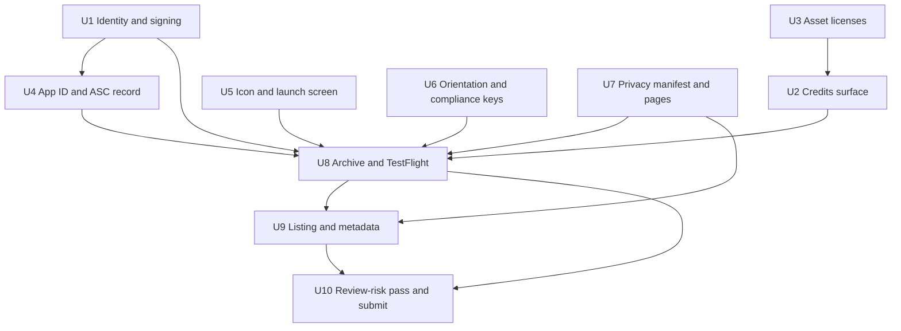

# iOS App Store Release - Plan

## Goal Capsule

- **Objective:** Take the Flutter taxi game from its `com.example` scaffold state to a build submitted for App Store review, distributed through TestFlight first.
- **Authority hierarchy:** Apple's published requirements outrank this plan; this plan outranks convenience. Where an Apple rule and a unit's Approach disagree, follow Apple and note the divergence.
- **Execution profile:** Configuration, packaging, and store operations. Most units are verified by a successful build, archive, upload, or App Store Connect state — not by unit tests. Two units (U2 credits surface, U6 orientation) touch Dart and carry real test scenarios.
- **Stop conditions:** Stop and surface if (a) the reserved app name is unavailable and no fallback is pre-approved, (b) archive validation fails for a reason not covered in Risks, or (c) App Review rejects on Guideline 4.2 or 4.3 — that outcome is a product decision, not an implementation retry.
- **Tail ownership:** The submitting human owns the App Store Connect actions that require account credentials. The implementing agent owns everything in the repo and the local archive.

---

## Product Contract

### Summary

Configure the existing Flutter game for real iOS distribution and carry it through Apple's submission pipeline. The work is app identity and signing, replacing placeholder icon and launch assets, satisfying Apple's privacy-manifest and export-compliance declarations, adding the attribution surface the bundled CC-BY music legally requires, then creating the App Store Connect record, uploading a signed archive to TestFlight, assembling the store listing, and submitting for review.

### Problem Frame

The project has never been built for a real device. It carries the identifiers and assets Flutter's scaffolding generated: bundle ID `com.example.taxiGame`, no development team, the stock Flutter app icon and launch image, and version `0.1.0+1`. `ios/Podfile` and `ios/Flutter/GeneratedPluginRegistrant.*` do not exist, confirming `flutter build ios` has not run in this tree. Separately, the bundled menu music is CC-BY 4.0 and ships with no attribution anywhere in the app, which is a license violation in a distributed build regardless of what Apple checks.

The existing GitHub Actions workflow builds iOS with `--no-codesign`, so it proves the code compiles but produces nothing installable and exercises none of the signing, entitlement, or upload path.

### Requirements

**App identity and signing**

- R1. The iOS bundle identifier is `com.wjdavis5.taxigame`, set in the Xcode project and matched by a registered App ID.
- R2. The Runner target signs against the enrolled Apple Developer Program team and produces a validated release archive.
- R3. Marketing version is `1.0.0` at submission; every upload carries a build number higher than any previously accepted build for the same version.
- R4. `CFBundleName` and `CFBundleDisplayName` present the shipping app name rather than the scaffold values `taxi_game` / `Taxi Game`.

**Presentation assets**

- R5. The app icon set carries a custom 1024×1024 marketing icon and every derived size, with no stock Flutter asset remaining.
- R6. The launch screen shows game-appropriate branding rather than Flutter's default `LaunchImage`.
- R7. Declared supported orientations in `Info.plist` match the orientations the app locks at runtime, on both iPhone and iPad.

**Legal and compliance**

- R8. The app carries an app-level `PrivacyInfo.xcprivacy` declaring its collected data types and any required-reason API usage.
- R9. `Info.plist` declares export-compliance status so uploads do not stall on the encryption question.
- R10. The app presents an in-app credits surface carrying the attribution text the bundled CC-BY 4.0 music requires, reachable from the main menu.
- R11. Every shipped asset's license permits commercial redistribution, and `assets/licenses/LICENSES.txt` names the actual files rather than placeholders.
- R12. The build is produced with Xcode 26 or later against the iOS 26 SDK, mandatory for App Store Connect uploads since 2026-04-28.

**Store presence**

- R13. An App Store Connect record exists for the bundle ID under an available, reserved app name.
- R14. The listing carries 6.9" iPhone screenshots and 13" iPad screenshots, since the app ships universal.
- R15. The age-rating questionnaire is complete, including its violence and social-media sections.
- R16. The App Privacy questionnaire is complete and consistent with R8.
- R17. A privacy policy URL and a support URL are published and reachable before submission.

**Delivery**

- R18. A signed build is installable from TestFlight internal testing and launches and plays on a physical iPhone.
- R19. The app is submitted for App Store review with all listing fields complete.

### Scope Boundaries

- iOS only. The macOS Runner target keeps its scaffold identifiers and is not configured, signed, or submitted.
- The Android CI job and Play Store distribution are untouched.
- Gameplay, level design, and art direction are not changed except where a build or review requirement forces it. The game ships with its current 10 levels.

#### Deferred to Follow-Up Work

- Automating signed builds and App Store Connect uploads in `.github/workflows/flutter-builds.yml` using an App Store Connect API key. Deliberately held until one manual submission has proven the signing and upload path.
- In-app purchases, ads, analytics, and Game Center. Each adds an App Privacy disclosure and a review surface this release does not need.
- Localization beyond the primary storefront language.

### Outstanding Questions

- **Blocking — none.** No question blocks implementation.
- **Deferred.** The shipping app name is unresolved: "Taxi Game" is likely taken, and App Store names are globally unique. U4 resolves this by checking availability and reserving from a candidate list; it is deferred rather than blocking because the check must happen inside App Store Connect anyway.
- **Deferred.** Whether the three bundled SFX files (`coin_collect.wav`, `button_click.wav`, `level_complete.wav`) came from a royalty-free source. `LICENSES.txt` lists candidate sources with placeholder file lists. U3 resolves provenance or replaces the files.

---

## Planning Contract

### Key Technical Decisions

- KTD1. **Bundle identifier `com.wjdavis5.taxigame`.** Reverse-DNS off the GitHub handle, requiring no owned domain. The identifier is permanent once an App Store Connect record binds to it, so this is settled before U4 registers the App ID. (session-settled: user-directed — chosen over a domain-based identifier: no domain is owned and a solo release does not need one.)

- KTD2. **First submission driven manually from Xcode; CI signing automation deferred.** `flutter build ipa` locally, validate and upload through Xcode's Organizer. The existing workflow keeps building unsigned as a compile check. (session-settled: user-approved — chosen over wiring an App Store Connect API key into GitHub Actions first: a first submission has enough unknowns without simultaneously debugging CI keychain and provisioning behavior.)

- KTD3. **Ship the current content; fix only what blocks a build or a review rejection.** No new levels, art, or mechanics. (session-settled: user-approved — chosen over expanding content before submitting: getting one build through the pipeline is the goal, and Guideline 4.2 exposure is accepted knowingly per Risks.)

- KTD4. **Stay universal across iPhone and iPad.** The project is already configured for both, so restricting would be a deliberate narrowing. The cost is a second screenshot set and iPad verification, both scoped into U7 and U8. (session-settled: user-approved — chosen over iPhone-only: the reduced review surface did not justify dropping iPad support the project already has.)

- KTD5. **Portrait-only, declared and enforced.** `lib/main.dart` locks to `portraitUp`/`portraitDown` at runtime while `Info.plist` advertises landscape on iPhone and all four orientations on iPad. Align the declaration to the runtime lock rather than the reverse — changing the game to landscape is a design change KTD3 excludes. This also fixes the iPad case, where the advertised-but-unreachable orientations are what a reviewer would exercise first.

- KTD6. **Automatic signing managed by Xcode.** Let Xcode create and manage the certificate and provisioning profile against the enrolled team. Manual profile management earns its complexity only when CI or multiple signing identities are in play, and KTD2 defers CI.

- KTD7. **App-level privacy manifest declaring no data collection.** The app has no network calls, analytics, or ads; `shared_preferences` 2.5.3 ships its own manifest for its `UserDefaults` required-reason API. The app-level manifest therefore declares an empty collected-data set, which must stay consistent with the App Privacy answers in U7.

- KTD8. **Credits rendered as a dedicated screen off the main menu.** A route reachable from the main menu, not a dialog buried in settings — the app has no settings screen, and CC-BY attribution needs to be findable. (session-settled: user-approved — the CC-BY obligation itself was surfaced during planning and accepted as in-scope.)

- KTD9. **Privacy policy and support pages hosted on GitHub Pages from this repo.** Both URLs are mandatory listing fields and neither exists. Serving them from `docs/` in the repo Apple's reviewer can already reach keeps them versioned alongside the app. (session-settled: user-approved — chosen over external hosting: no other host is in play.)

### High-Level Technical Design

Submission is a dependency chain, not a checklist. Repo-side units feed a single archive; store-side units feed a single listing; the two meet at submission.

The archive gate at U8 is where most failure surfaces: signing, entitlements, missing icon sizes, and the privacy manifest are all validated there rather than at build time. Everything feeding U8 should be complete before the first upload attempt, because each rejected upload burns a build number.

### Assumptions

- The Apple Developer Program membership is active and the account has the Account Holder or Admin role needed to create App IDs and app records.
- Xcode 26.6 and Flutter 3.44.8 are the toolchain, both verified present locally. Xcode 26.6 satisfies R12.
- A physical iPhone is available for the U8 install check. Simulator-only verification would leave R18 unproven.
- CocoaPods 1.17.0 is on `PATH` via rbenv shims and can generate `ios/Podfile` on first build.

### Sequencing

U1, U3, U5, U6, and U7 are independent and can proceed in any order. U2 depends on U3 establishing what attribution text is owed. U4 depends only on the bundle ID from U1 and should run early, because App ID propagation and name reservation are the steps most likely to surface an account-level surprise. U8 is the integration gate. U9 needs a running build for screenshots. U10 is last.

---

## Implementation Units

### U1. iOS app identity and signing baseline

**Goal:** The Runner target carries the real bundle identifier, signs against the enrolled team, and produces a release build for a physical device.

**Requirements:** R1, R2, R3, R4, R12

**Dependencies:** none

**Files:**
- `taxi_game/ios/Runner.xcodeproj/project.pbxproj`
- `taxi_game/ios/Runner/Info.plist`
- `taxi_game/pubspec.yaml`

**Approach:**
1. Set `PRODUCT_BUNDLE_IDENTIFIER` to the KTD1 value across all three build configurations, and set the RunnerTests bundle ID to the matching `.RunnerTests` suffix.
2. Set `DEVELOPMENT_TEAM` to the enrolled team ID and enable automatic signing per KTD6.
3. Update `CFBundleName` and `CFBundleDisplayName` to the shipping name. `CFBundleDisplayName` is what appears under the home-screen icon and should stay short enough not to truncate.
4. Bump `version:` in `pubspec.yaml` to `1.0.0+1` per R3.
5. Run a device build to force CocoaPods to generate `ios/Podfile` and the plugin registrant, both absent today.

**Execution note:** This is configuration; prove it with a real device install rather than unit coverage. The signal that U1 worked is the app launching on hardware under the new identifier.

**Patterns to follow:** Flutter's documented iOS release setup — the Xcode General and Signing & Capabilities tabs, not hand-edited `project.pbxproj` where the UI is available.

**Test scenarios:**
- Test expectation: none -- pure build configuration with no behavioral change. Verified by build and install outcomes below.

**Verification:** `flutter build ios --release` completes with signing, the resulting app installs on a physical iPhone, and the installed bundle identifier reads `com.wjdavis5.taxigame`.

---

### U2. In-app credits and attribution surface

**Goal:** The app carries the attribution the bundled CC-BY 4.0 music legally requires, reachable from the main menu.

**Requirements:** R10

**Dependencies:** U3

**Files:**
- `taxi_game/lib/ui/screens/credits_screen.dart` (new)
- `taxi_game/lib/ui/screens/main_menu_screen.dart`
- `taxi_game/test/credits_screen_test.dart` (new)

**Approach:**
1. Build a credits screen per KTD8 rendering the attribution blocks that U3 finalized in `assets/licenses/LICENSES.txt` — at minimum the Kevin MacLeod / Incompetech CC-BY line with the license URL and track name, plus the Kenney CC0 acknowledgement.
2. Add a menu entry on `MainMenuScreen` routing to it, matching the existing menu buttons' construction rather than introducing a new button style.
3. Source the attribution text from a single owning location so the screen and `LICENSES.txt` cannot drift.

**Patterns to follow:** `lib/ui/screens/main_menu_screen.dart` for screen scaffolding, navigation, and theming; `lib/ui/screens/game_screen.dart` for how screens consume provided services.

**Test scenarios:**
- Rendering the credits screen displays the Incompetech CC-BY attribution string including the track name and the `creativecommons.org/licenses/by/4.0/` URL.
- Rendering the credits screen displays the Kenney CC0 acknowledgement.
- Tapping the credits entry on the main menu navigates to the credits screen.
- The credits screen renders without overflow at a narrow portrait width, since the attribution text is long and the app is portrait-locked.
- Navigating back from credits returns to the main menu with menu state intact.

**Verification:** The attribution text visible in the running app matches `assets/licenses/LICENSES.txt` for every asset whose license requires attribution, and the screen is reachable in at most one tap from the main menu.

---

### U3. Asset license verification and manifest cleanup

**Goal:** Every shipped asset is confirmed licensed for commercial redistribution, and the license file names actual files.

**Requirements:** R11

**Dependencies:** none

**Files:**
- `taxi_game/assets/licenses/LICENSES.txt`
- `taxi_game/assets/audio/sfx/ui/` (potential replacements)

**Approach:**
1. Resolve the provenance of `coin_collect.wav`, `button_click.wav`, and `level_complete.wav`. `LICENSES.txt` lists Sonniss, Freesound, and JSFXR as candidate sources with placeholder file lists, so none of the three is currently attributable.
2. Where provenance cannot be established, regenerate the sound from a source whose license is unambiguous rather than shipping an unattributable file.
3. Replace every `[List ... when added]` placeholder with the real file inventory, and confirm the vehicle sprites in use are the CC0 Kenney set rather than the OpenGameArt alternates the file lists as optional.
4. Record the exact attribution strings U2 must render.

**Execution note:** Resolve licensing before U2 renders text — the credits screen's content is this unit's output.

**Test scenarios:**
- Test expectation: none -- documentation and asset provenance work with no code path. Verified by the inventory check below.

**Verification:** Every file under `taxi_game/assets/` appears in `LICENSES.txt` with a named source and license, no placeholder brackets remain, and no asset carries a non-commercial or no-derivatives restriction.

---

### U4. App ID registration and App Store Connect record

**Goal:** A registered App ID and an App Store Connect app record exist under a reserved, available name.

**Requirements:** R13

**Dependencies:** U1

**Files:** none — this unit operates entirely in Apple's developer portals.

**Approach:**
1. Register the KTD1 bundle identifier as an explicit App ID with no additional capabilities, since the app uses no entitlement-bearing services.
2. Check name availability, starting with the current display name and falling back through a candidate list. Reserving the record claims the name, so decide before creating rather than after.
3. Create the app record bound to that App ID with the primary language set and the SKU assigned.

**Execution note:** Run this early. App ID propagation and name contention are the failure modes most likely to need a human decision, and discovering them at archive time wastes a build number.

**Test scenarios:**
- Test expectation: none -- external portal configuration with no repo artifact.

**Verification:** The app record appears in App Store Connect bound to `com.wjdavis5.taxigame`, and Xcode's automatic signing resolves a provisioning profile for that identifier without manual intervention.

---

### U5. App icon and launch screen

**Goal:** No stock Flutter presentation asset remains in the shipping build.

**Requirements:** R5, R6

**Dependencies:** none

**Files:**
- `taxi_game/ios/Runner/Assets.xcassets/AppIcon.appiconset/`
- `taxi_game/ios/Runner/Assets.xcassets/LaunchImage.imageset/`
- `taxi_game/ios/Runner/Base.lproj/LaunchScreen.storyboard`

**Approach:**
1. Produce a 1024×1024 marketing icon and generate the full derived size set. The current set is Flutter's default, untouched since scaffolding, and Apple rejects placeholder icons.
2. The 1024 marketing icon must be fully opaque with no alpha channel and no rounded corners — alpha in the marketing icon is a common upload-validation failure.
3. Replace the `LaunchImage` asset the storyboard references. The storyboard's structure can stay; only the referenced image changes.

**Patterns to follow:** The existing `AppIcon.appiconset/Contents.json` defines the required size and scale matrix — populate against it rather than inventing filenames.

**Test scenarios:**
- Test expectation: none -- asset replacement with no behavioral change. Verified visually and by archive validation.

**Verification:** The home-screen icon and launch screen show game branding on a physical device, and archive validation reports no missing or malformed icon sizes.

---

### U6. Orientation declaration and export-compliance keys

**Goal:** Declared orientations match runtime behavior, and the export-compliance answer is baked in.

**Requirements:** R7, R9

**Dependencies:** none

**Files:**
- `taxi_game/ios/Runner/Info.plist`
- `taxi_game/lib/main.dart`
- `taxi_game/test/orientation_test.dart` (new)

**Approach:**
1. Narrow `UISupportedInterfaceOrientations` and `UISupportedInterfaceOrientations~ipad` to portrait per KTD5. The iPad key currently advertises all four orientations while the app locks to portrait, so a reviewer rotating an iPad sees the mismatch immediately.
2. Add `ITSAppUsesNonExemptEncryption` set to false. Without it, every upload stalls on the export-compliance question before the build reaches TestFlight.
3. Confirm `lib/main.dart` still locks orientation at startup and that the plist is now the narrower of the two declarations.

**Test scenarios:**
- On startup the app requests only portrait orientations, asserted against the platform channel call `main()` issues.
- The `Info.plist` iPhone and iPad orientation arrays each contain only portrait entries and no landscape entry.

**Verification:** The app cannot be rotated into landscape on either an iPhone or an iPad, and an upload proceeds to TestFlight without prompting for export compliance.

---

### U7. Privacy manifest and published policy pages

**Goal:** The app declares its privacy posture in-bundle, and the two mandatory listing URLs are live.

**Requirements:** R8, R17

**Dependencies:** none

**Files:**
- `taxi_game/ios/Runner/PrivacyInfo.xcprivacy` (new)
- `taxi_game/ios/Runner.xcodeproj/project.pbxproj`
- `docs/privacy-policy.md` (new)
- `docs/support.md` (new)

**Approach:**
1. Add an app-level privacy manifest per KTD7 declaring an empty collected-data set and no required-reason API usage of the app's own. `shared_preferences` 2.5.3 supplies its own manifest for its `UserDefaults` access, so the app-level file does not restate it.
2. Add the manifest to the Runner target's Copy Bundle Resources; a manifest present on disk but not bundled has no effect and fails silently.
3. Write the privacy policy stating the app collects and transmits nothing and stores progress only on-device, which is what `StorageService` does.
4. Write a support page with a contact route.
5. Publish both via GitHub Pages per KTD9 and confirm the URLs resolve publicly, not just in the repo.

**Execution note:** Verify the published URLs from outside any authenticated session — a page that renders for the repo owner but 404s for a reviewer fails R17 at exactly the wrong moment.

**Test scenarios:**
- Test expectation: none -- bundle configuration and published documents with no app code path.

**Verification:** `PrivacyInfo.xcprivacy` is present inside the built `.app` bundle, and both URLs return content in a logged-out browser session.

---

### U8. First signed archive and TestFlight distribution

**Goal:** A signed build reaches TestFlight and runs on a physical iPhone.

**Requirements:** R2, R3, R12, R18

**Dependencies:** U1, U2, U4, U5, U6, U7

**Files:** none — consumes the build output under `taxi_game/build/ios/` and operates in Xcode Organizer.

**Approach:**
1. Produce the release archive with `flutter build ipa --release`, which emits both an `.xcarchive` and an `.ipa`.
2. Validate before uploading. Validation catches missing icon sizes, entitlement mismatches, and manifest problems locally, where fixing them costs nothing.
3. Upload through Xcode's Organizer per KTD2.
4. Wait for processing, then enable internal TestFlight testing and install on a physical device.
5. Play through at least one level end to end, and confirm the credits screen from U2 is reachable in the shipped build.

**Execution note:** Each rejected upload consumes a build number irreversibly. Validate first, and treat the first successful upload as the integration proof for every preceding unit.

**Test scenarios:**
- Test expectation: none -- distribution operation. Its proof is the device run below, which exercises the whole app rather than any single unit.

**Verification:** The build appears in TestFlight without an export-compliance prompt, installs on a physical iPhone, launches, completes a level, and shows the credits screen.

---

### U9. Store listing and metadata

**Goal:** Every required listing field is complete and consistent with the build.

**Requirements:** R14, R15, R16

**Dependencies:** U7, U8

**Files:** none — store metadata lives in App Store Connect.

**Approach:**
1. Capture screenshots from the TestFlight build at 6.9" iPhone (1320×2868) and 13" iPad (2064×2752). Apple scales these down to populate smaller device classes, so only these two sets are needed, but the iPad set is required because the app ships universal per KTD4.
2. Write the description, subtitle, keywords, and promotional text. Describe what the game does; Guideline 2.3 treats overstated descriptions as grounds for rejection.
3. Complete the age-rating questionnaire under the current 4+/9+/13+/16+/18+ system, answering the violence section honestly — vehicle collisions are the relevant content — and the social-media section, which the app does not have.
4. Complete the App Privacy questionnaire declaring no data collection, matching the U7 manifest per KTD7.
5. Set pricing, availability, and the category.

**Test scenarios:**
- Test expectation: none -- store metadata entry with no repo artifact.

**Verification:** App Store Connect reports no missing required fields, and the App Privacy answers match `PrivacyInfo.xcprivacy`.

---

### U10. Pre-submission review-risk pass and submission

**Goal:** Known rejection risks are addressed or knowingly accepted, and the app is submitted.

**Requirements:** R19

**Dependencies:** U8, U9

**Files:** none — submission operates in App Store Connect.

**Approach:**
1. Walk the app against the Risks below, focusing on Guideline 4.2 minimum functionality — the live exposure for a game of this size under KTD3.
2. Confirm no placeholder text, debug UI, or unreachable menu entry ships. `debugShowCheckedModeBanner` is already false.
3. Add reviewer notes describing how to reach gameplay from a cold launch, so a reviewer does not have to discover the flow.
4. Submit for review.

**Test scenarios:**
- Test expectation: none -- submission operation.

**Verification:** The app reaches "Waiting for Review" in App Store Connect with no outstanding warnings.

---

## Verification Contract

| Gate | Command or action | Applies to |
|---|---|---|
| Static analysis | `flutter analyze` in `taxi_game/` | U2, U6 |
| Unit and widget tests | `flutter test` in `taxi_game/` | U2, U6 |
| Release build | `flutter build ios --release` | U1 |
| Archive | `flutter build ipa --release` | U8 |
| Archive validation | Xcode Organizer "Validate App" before upload | U8 |
| Device run | Install from TestFlight, play one level, open credits | U8 |
| Asset inventory | Every file under `taxi_game/assets/` named in `LICENSES.txt` | U3 |
| Public URL check | Both GitHub Pages URLs resolve logged-out | U7 |
| Listing completeness | App Store Connect reports no missing required fields | U9 |

The existing `.github/workflows/flutter-builds.yml` continues to run `flutter analyze`, `flutter test`, and an unsigned iOS build on every push to `main`. It is a compile check, not a release gate, and KTD2 leaves it unchanged.

---

## Definition of Done

**Global**

- The app is in "Waiting for Review" under bundle ID `com.wjdavis5.taxigame`.
- A TestFlight build has been installed and played on a physical iPhone.
- No stock Flutter presentation asset remains in the shipping bundle.
- Every shipped asset's attribution obligation is satisfied in-app and in `LICENSES.txt`.
- `flutter analyze` and `flutter test` pass.
- Any experimental signing configuration, scratch entitlement, or abandoned asset variant produced along the way is removed from the diff.

**Per unit**

| Unit | Done signal |
|---|---|
| U1 | Device install reports the new bundle identifier |
| U2 | Credits reachable in one tap and matching `LICENSES.txt` |
| U3 | No placeholder brackets and no restrictive license in the inventory |
| U4 | Xcode resolves a profile for the identifier automatically |
| U5 | Archive validation reports no icon problems |
| U6 | App cannot rotate on iPhone or iPad; no export-compliance prompt |
| U7 | Manifest inside the built bundle; both URLs resolve logged-out |
| U8 | Build playable from TestFlight on hardware |
| U9 | No missing required fields in App Store Connect |
| U10 | Submitted with reviewer notes attached |

---

## Risks & Dependencies

- **Guideline 4.2, minimum functionality.** The live rejection risk. Apple rejects apps that read as demos or as thin experiences, and a 10-level game built on stock assets sits inside that judgment zone. KTD3 accepts this knowingly. If rejected here, the response is a product decision about content depth, not an implementation retry — see the Goal Capsule stop conditions.

- **Guideline 4.3, spam and duplication.** The Kenney CC0 sprite set is used by a very large number of published apps, and "taxi game" is a crowded category. Distinct branding at U5 and an honest, specific description at U9 are the available mitigations.

- **CC-BY attribution.** Shipping the Incompetech track without attribution is a license violation independent of anything Apple checks. U2 and U3 close it. The 8.7 MB music file is also the bundle's largest asset, which is worth knowing but is not a submission problem.

- **App name contention.** "Taxi Game" is very likely taken and names are globally unique. Reserving a name in U4 is effectively irreversible for that record, so the fallback list should be decided before the record is created.

- **Unattributable SFX.** Three WAV files have no confirmed source. Replacement is cheap now and expensive after submission; U3 handles it.

- **Xcode 26 SDK floor.** Uploads have required Xcode 26 and the iOS 26 SDK since 2026-04-28. Xcode 26.6 is installed locally, so this is satisfied — but it constrains any future move of the release build onto a runner with an older image.

- **Build-number consumption.** Every upload attempt burns a build number permanently, including rejected ones. This is why U8 validates before uploading and why the units feeding it complete first.

- **Account role dependency.** Creating App IDs and app records requires Account Holder or Admin. If the enrolled account lacks the role, U4 blocks on an account change rather than on anything in the repo.

---

## Sources / Research

- Local repo state establishing the starting point: `PRODUCT_BUNDLE_IDENTIFIER = com.example.taxiGame` with no `DEVELOPMENT_TEAM` in `taxi_game/ios/Runner.xcodeproj/project.pbxproj`; app icon set last touched in the scaffolding commit `ea5fca8`; absent `ios/Podfile` and `ios/Flutter/GeneratedPluginRegistrant.*`; `version: 0.1.0+1` in `taxi_game/pubspec.yaml`; portrait lock in `taxi_game/lib/main.dart` against a landscape-permitting `taxi_game/ios/Runner/Info.plist`.
- `taxi_game/assets/licenses/LICENSES.txt` — the CC-BY 4.0 music obligation and the unresolved SFX provenance that drive R10, R11, U2, and U3.
- [Flutter iOS deployment guide](https://docs.flutter.dev/deployment/ios) — the `flutter build ipa` and Organizer upload path underpinning KTD2 and U8.
- [Apple: upcoming SDK minimum requirements](https://developer.apple.com/news/upcoming-requirements/) and [Apple's SDK announcement](https://developer.apple.com/news/?id=ueeok6yw) — the Xcode 26 / iOS 26 SDK floor effective 2026-04-28 behind R12.
- [Apple: updated age ratings in App Store Connect](https://developer.apple.com/news/?id=ks775ehf) and [social-media questions added to the questionnaire](https://developer.apple.com/news/?id=tlur8uvi) — the expanded questionnaire behind R15.
- [App Store screenshot sizes for 2026](https://appscreens.com/app-store-screenshot-sizes) — the 6.9" iPhone and 13" iPad base sizes behind R14, and the reason KTD4's universal choice adds a second capture set.
- [flutter/flutter#139758, shared_preferences privacy manifest](https://github.com/flutter/flutter/issues/139758) — confirms the plugin ships its own manifest, so KTD7's app-level manifest does not restate its required-reason API.
